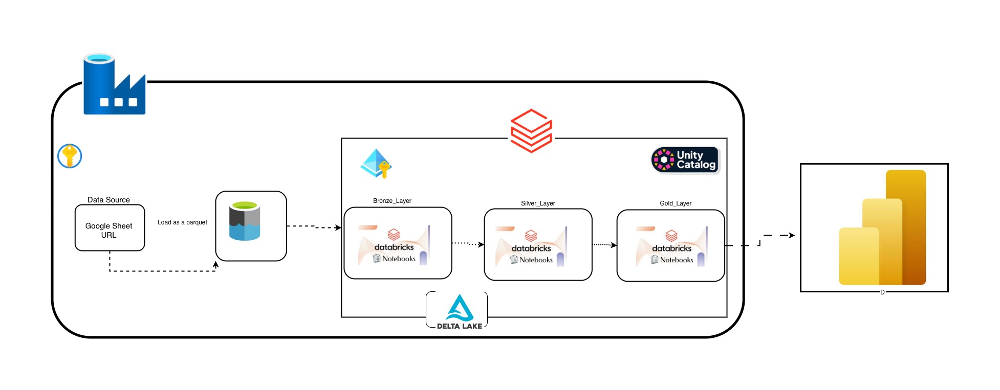

# InsureFlow Data Platform

---

## Overview

InsureFlow is an end-to-end data platform built for a fictional UK insurance company offering Health, Life, Property, and Auto coverage.

The focus of this project was not just building pipelines, but designing a reliable, scalable data platform that transforms messy, fragmented data into trusted business intelligence.

Built on Azure + Databricks using a Medallion Architecture, the platform handles ingestion, transformation, governance, and analytics seamlessly.

---

## The Problem

 Before this platform:
---

No single source of truth

Data scattered across systems

Heavy reliance on spreadsheets

Inconsistent reporting

Simple business questions were hard to answer:

What is our claims ratio this quarter?

Which agents are driving the most revenue?

This project answers that.
---

## Architecture

| Layer | Tool | Purpose |
|---|---|---|
| Staging | ADLS Gen2 | Raw parquet files, dated folders |
| Bronze | Delta Lake | Raw ingestion, append only, no changes |
| Silver | Delta Lake | Cleaned, masked, SCD Type 2 |
| Gold | Delta Lake | Star schema and KPI tables |

*Built on Azure Data Factory · Databricks · Delta Lake · Unity Catalog · PySpark*
---

## Dataset

| Table ||
|---|---|
| customers ||
| policies ||
| claims ||
| payments ||
| agents ||
| coverage ||
| risk_assessment ||

Quality issues included: nulls, negative values, duplicates, invalid dates, inconsistent casing, outliers and Windows carriage return characters in column names.

---

## What Each Layer Does

**Staging** — Data Flow 🟡 
ADF ingests data into ADLS (yyyy/MM/dd)

No transformations — raw landing only

### (Medallion Architecture) 

🟤 **Bronze** —  (Delta Lake)
Append-only ingestion

Full audit trail preserved

No updates or deletes

✅ Idempotent Design

Re-running ingestion does not duplicate or corrupt data

✅ Schema Evolution

New columns from source are automatically handled

Prevents pipeline failures from schema drift

**Silver** — Where the real work happens. Duplicates removed, types cast, strings standardised, invalid records filtered, PII masked and SCD Type 2 implemented to track record changes over time. MERGE used for all upserts — no duplicates, no full reloads.

**Gold** — Two outputs. A star schema for BI connectivity and pre-aggregated KPI tables for fast dashboard queries.

---

## Key Technical Implementations

**Incremental Loading** — Bronze only picks up today's files. Silver filters by ingestion date and merges only new records. Gold rebuilds aggregations fresh each run.

**SCD Type 2** — Tracks how customer records change over time. When a key field changes, the old record is expired with an end date and a new version is inserted. Full history is preserved while current records are always queryable with `WHERE is_current = true`.

**PII Masking** applied at silver  NI numbers, bank accounts, dates of birth, emails and phone numbers are all partially obscured before any business user access.

**Schema Evolution** — handled per table using `.option("mergeSchema", "true")` on writes rather than a global config. Intentional and controlled.

**Star Schema** in Gold — `fact_claims` sits at the centre joined to `dim_customers`, `dim_agents`, `dim_policies` and `dim_date`. Dimensions contain no PII and no technical SCD columns — clean and reporting ready.

---

## Best Practices

- No hardcoded secrets — all credentials in Azure Key Vault, accessed via service principal OAuth
- Unity Catalog for access control across all Delta tables
- One notebook per table in silver — easy to debug, rerun and explain
- ForEach loop in ADF handles all seven tables dynamically — no copy-paste pipelines
- Storage event trigger fires only when files arrive — no wasted compute on empty runs
- Append only bronze means full audit trail and safe reprocessing at any time

---

## Cost Awareness

- Parquet in staging cuts file size significantly versus CSV
- Incremental loading keeps computation proportional to new data not total data
- Job clusters used for production runs — much cheaper than keeping interactive clusters alive
- Dated folder partitioning in ADLS enables lifecycle policies to archive old staging files automatically
- Gold aggregations are lightweight rebuilds — overwrite is fast and avoids stale data accumulating

---

## Outcomes

Four business KPIs now served reliably:

- Claims ratio by insurance type
- Revenue and commission per agent
- Customer risk distribution for underwriting
- Policy lapse rate trends for retention strategy

---

## Project Structure

InsureFlow/
├── 01_bronze/
├── 02_silver/         ← one notebook per table
├── 03_gold/
├── 04_orchestration/
└── README.md

